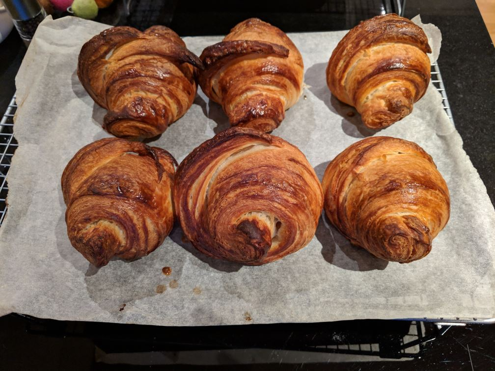

 My wife Claire is the Bread Maker in Chief our household. She makes a couple of loaves a week of sourdough, and it is marvelous stuff. But about once every three months, I have a go myself, and the other day I made these great looking croissants.
 
 
 Croissants are, however, a lot of work.  Over the course of several hours, you have to repeatedly take the rectangular slab of interleaved dough and butter, turn it, roll it, carefully fold it over itself, and put it back in the fridge.  In truth, it's not that it's a lot of work: each rolling out and reshaping only takes 5 or 10 minutes.  It's mostly that you have to do it a number of times, so you end up interrupting your day to do this same thing every hour, to achieve the many fine layers that make croissants so delicious.
 
 And they are delicious, too. The end result is amazing - with just butter, the classic strawberry jam, or especially Nutella. (Almost everything is amazing with Nutella, now I think about it)
 
 Here's the thing, though: no matter how fabulous the result - twice as good as shop-bought ones, I assure you - you have to enjoy the process of getting there. Otherwise it isn't going to happen. Like many of us, I find it hard to make myself do something unpleasant regardless of a happy outcome.
 
 But if we're not careful, we find ourselves stuck in these loops all the time in our life: I'll be happy when I've got a new car (which will involve scrimping and saving in the meantime), or when I've lost this weight (which will involve a difficult diet), or when it gets to Friday night (when this endless work week has finished).
 
 This is Conditional Happiness: I'll be happy if X happens, or when I've got Y, or not until Z. All of which is very unhelpful, as it means you're not letting yourself be happy right now.  That's not good for you. You need to stop that, right now.
 
 Mindfulness can help: pay attention to the little details of whatever it is you're doing. Look at the smallest part of it, the tiniest step, and see beauty in the precision and detail there. God is in the details, they say
 
 Sometimes, it helps to remember that there is always someone who absolutely loves the thing you're doing. Think why they might enjoy it, and see if you can find the same.
 
 We can also take joy in the step by step progress of the work. One good trick is to focus on the smaller number, so if you have to swim 50 lengths for your exercise, start by counting up (I've done the first one, five, ten lengths), then switch to counting down when you're over half way (only twenty more to go, only ten, last five!).
 
 I enjoy making the croissants. My wife loves the process of making bread. Sure, the results are great, but it's the process that's just as enjoyable.