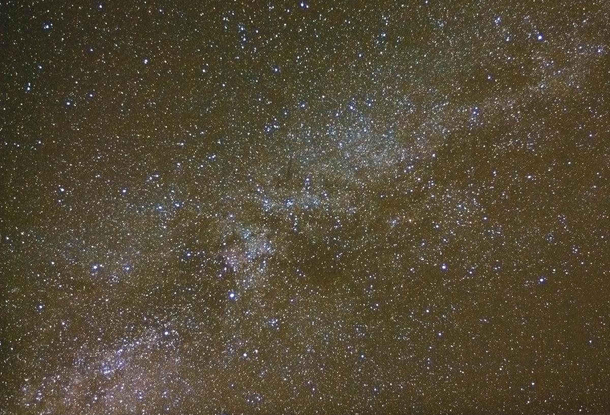

Every day, we start the day with a certain set of expectations, and our own set of strengths and weaknesses to bring to bear on them.  Some days seem to work out ok, while others just seem to run off track, despite our best intentions.  

And the same is true of our meditation, of course.  We sit down to meditate, and one day it might seem to flow really easily.  We will follow along with the breath, or the scan of our body, accurately witnessing what's going on, without much distraction.  The next day we sit down, fired with enthusiasm, and this time we hit a wall of worry, or thoughts about what we should buy for dinner or today's chores keep popping into our mind.  

So there is a wide range of experience.  And the first part of the trick in meditation, if there is one, is to accept them all.  All kinds of thoughts and feelings will appear, we will have excellent days and terrible days.  Don't dwell on the bad ones, and smile on the good ones. It's all grist to the mill.    The second part of the trick is to see that this day-to-day, and minute-by-minute and even moment-by-moment change, is an essential part of life.  It is literally built in to the fabric of our universe - quantum mechanics tells us that even the hard vacuum of empty space between galaxies is a seething mass of energy, at the sub-atomic level. 

The Buddhists talk of the three characteristics of existence, and one of these is Impermanence. All life, they say, is like a flowing river, and moment by moment it changes, even if we stay in the same place and stare at one spot.  Modern physics has just rediscovered this 2,500 year old truth and given it new clothes.

This can be a ray of hope in times of distress, because in truth we do know that even this horrible experience will change.  It will pass down the river.  And when things are good, it should also encourage us to enjoy the moment, because this good moment too will sooner or later move along.

No reason not to enjoy it when it's here, though - actually, all the more reason to enjoy it!  Our thoughts are like the hundred million stars in the milky way (featured above from my back garden).  On a clear night they sparkle with awe-inspiring beauty.  On a stormy night, you're going to get wet out there trying to look at them, so come inside, and wait for it to pass.  For it will pass, even if it sometimes takes days.  Get yourself some hot chocolate in the meanwhile.  You'll get to enjoy them again, never fear.  That's the truth of existence.