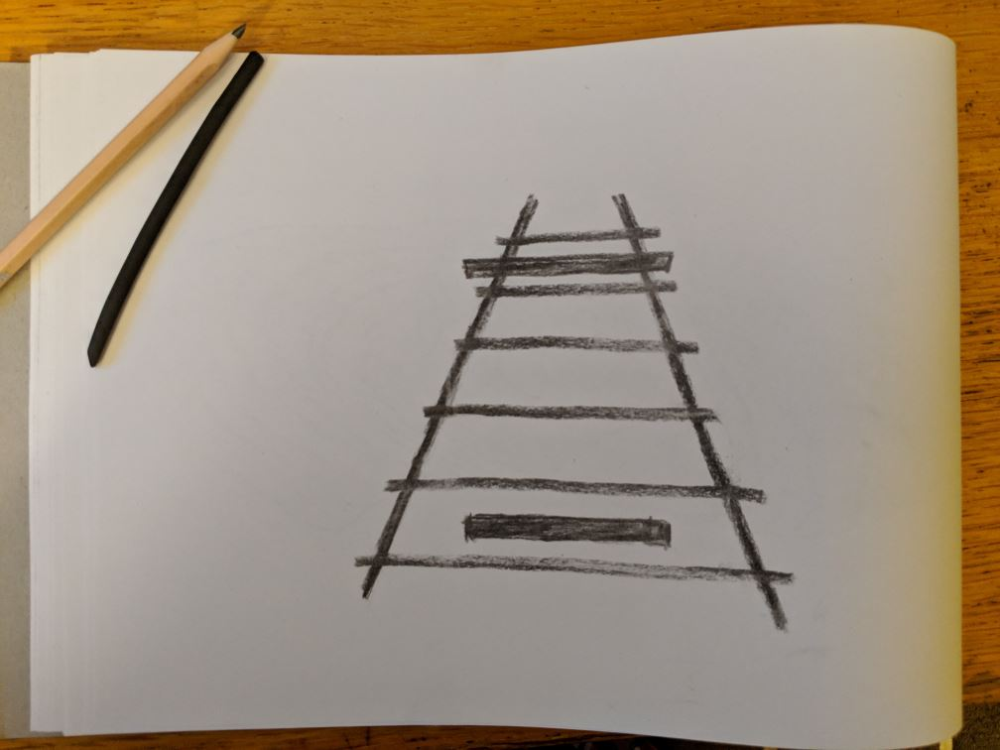

I love optical illusions. This particular one shows our brain trying to make sense of perspective - the two horizontal boxes are the same width, but the top one looks wider than the bottom one because of what look like the "railway lines" behind them.

[There are lots of theories](https://en.wikipedia.org/wiki/Optical_illusion#Explanation_of_cognitive_illusions) about what's going on in our brains when we see things like this.  But what we know for sure, is that our brain is telling us something about the world that isn't true.

This happens all the time - I know, for example, it's happening right now, as you read these words.  The image in your eye is picked up by the retina at the back of your eyeball.  One part of the retina is called the [blind spot](https://en.wikipedia.org/wiki/Blind_spot_(vision)), because there are actually no optic nerves there - it's where all the nerve connections are routed off back to your brain.  But we don't see a blank spot in our vision.  Instead, our brain just covers it up, with the average of what's around it. 

That's our brain again, making stuff up about the world. So when someone seems to act completely out of character, or you see something wildly implausible in the news, or you start getting stressed about something that happened - or is about to happen - you shouldn't immediately think that this is the way the world is. Investigate. Do a little digging. Is there another perspective? You might even find that your brain, or someone else's brain, was making stuff up again.