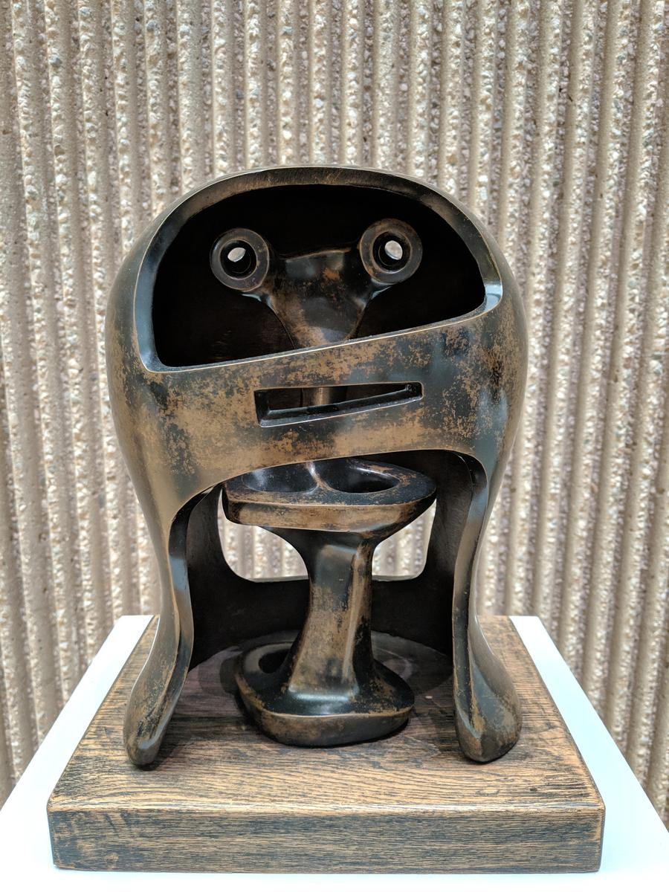

Let's face it, some days are pretty awful. Maybe it's something dramatic - you are laid off at work, or someone near to you is diagnosed with something really bad, or you return to your car to find a huge scrape all the way along one side and no note of apology under the windscreen wiper.   

Maybe it's something that might appear trivial to others - you tread on an errant piece of Lego and spill your cup of tea on your clean clothes.  Or maybe you're just having a bad day, for no reason other than the chemicals in your brain are conspiring against you this week. For whatever reason, these days are tough.  

I'm not now going to tell you to "be positive" or "look on the bright side" or "cheer up", because if it were that simple you wouldn't be here in the first place (or not for more than ten minutes).  Nor am I going to tell you that "the universe will provide", because it won't - it generally seems to be utterly indifferent to our fate, if capable of the odd moment of awe-inspiring beauty.  And I certainly can't guarantee that "it'll be all right in the end", because, again, life isn't like that.  

All I can suggest is you sit with it.  Sit upright, sit with dignity, and look at it.  Breath in, and know you're breathing in; breath out, and know you're breathing out.  Don't shy away from the pain or the sadness - in the end, we all die, you know that.  Sit with it.  Let it come, let it stay, and then let it go.  Your life may not improve instantly, but what you're after here is some calm.  Equanimity is not a bad place to be, even in the worst of circumstances.  You are free to be still for a few moments, even in the middle of a storm.

And, sometimes at least, we may notice that we are applying a rather dark filter to it all.  Generally, things aren't maximally bad.  We lost our job, but we found another one a few weeks later, and even if it doesn't pay quite as well, the commute is shorter, and we're still here, struggling on. The diagnosis was bad, but it allowed us a few months or even days to say what we wanted to say.  Our tea-besmirched clothing can go in the wash, and being ten minutes late isn't the end of the world.  

I hope your day is one of the good ones, but if it isn't, meditation is there for you. 
